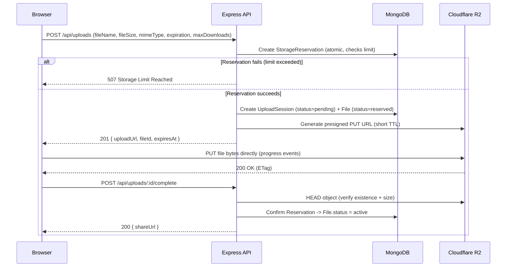
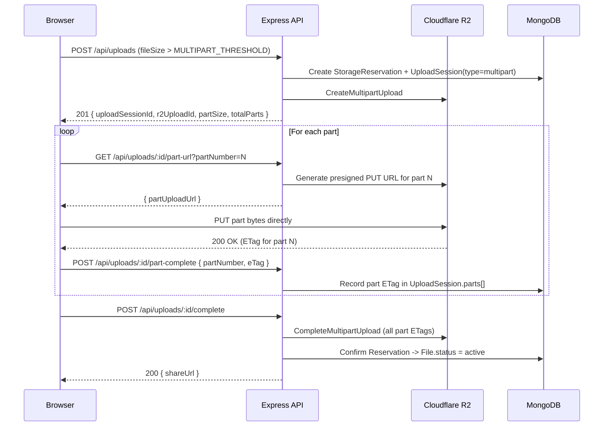
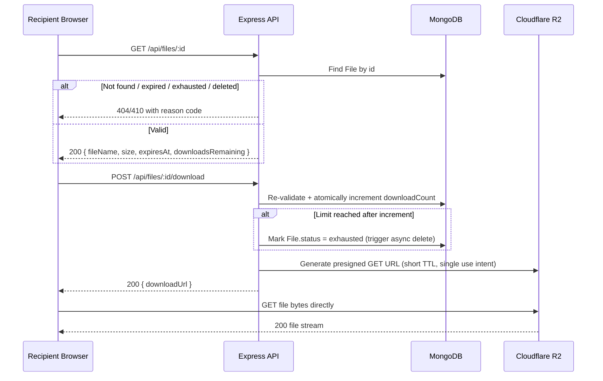
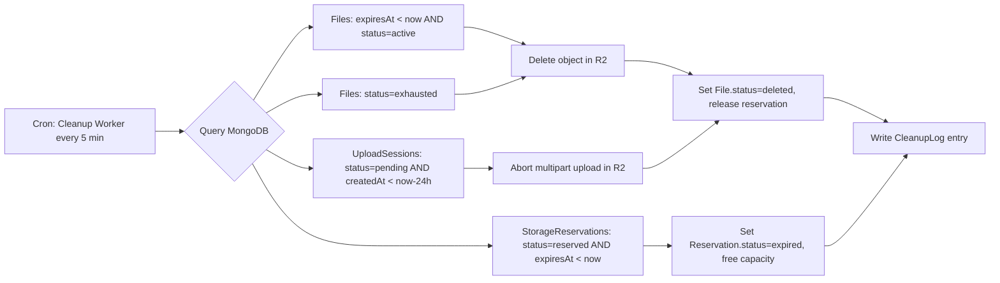
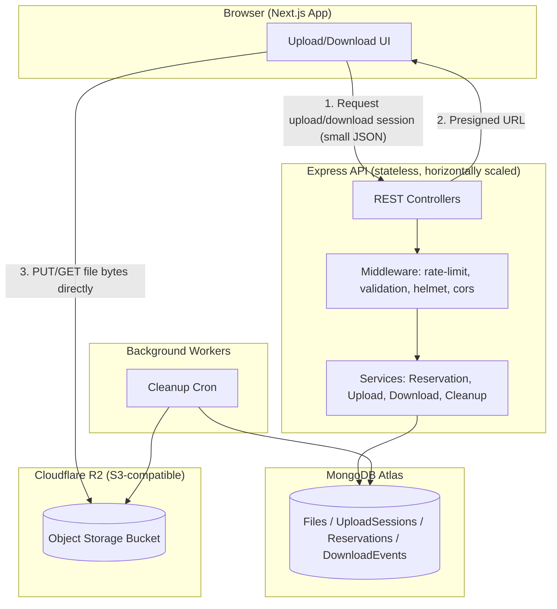

# FileDrop — Product Requirements Document

**Version:** 1.0
**Status:** Draft for Engineering Handoff
**Owner:** Product/Architecture
**Last Updated:** 2026-08-12

---

## 1. Executive Summary

FileDrop is a temporary, secure file-sharing web application. A user uploads a file directly from their browser to Cloudflare R2 (S3-compatible object storage), and FileDrop generates a short-lived, unpredictable share link. Anyone with that link can view file metadata and download the file, subject to expiration time, download-count limits, and optional one-time-download semantics. Files are automatically purged after expiration or after exhausting their download limit.

The system is architected so that **large binary payloads never pass through the Node.js/Express server**. Express is used only to authorize operations and broker short-lived presigned URLs; the actual bytes move directly between the browser and Cloudflare R2. This keeps the backend cheap to run, horizontally scalable, and capable of handling files up to ~10 GB without proxy bottlenecks.

FileDrop targets an MVP with **no mandatory authentication** — anyone can drop a file and share a link, similar in spirit to WeTransfer or Firefox Send. The architecture is designed so authentication can be layered in later without a rewrite.

---

## 2. Problem Statement

People frequently need to send large files to others without:
- Creating permanent cloud storage clutter
- Managing folder permissions in Google Drive/Dropbox
- Paying for a plan just to send one large file
- Worrying about the file lingering online indefinitely

Email attachment limits (typically 25 MB) make this worse. Existing "temporary share" products either have low free-tier size caps, inject heavy ads/tracking, or fully proxy uploads through their own servers (slow, costly, capped by server bandwidth/memory).

FileDrop solves this with direct-to-object-storage uploads, sane automatic expiration, and a minimal, trustworthy UI.

---

## 3. Goals

1. Allow any visitor (no login) to upload a file up to ~10 GB and receive a shareable link within seconds of upload completion.
2. Ensure uploaded bytes never transit through the Express server.
3. Automatically and reliably delete files after expiration or download-limit exhaustion, both in R2 and MongoDB.
4. Prevent storage-limit race conditions under concurrent uploads via an atomic reservation system.
5. Provide a modern, minimal, trustworthy SaaS-grade UI/UX.
6. Ship an MVP that is secure by default (no leaked credentials, rate-limited, validated inputs).
7. Design cleanly enough that authentication, teams, and paid tiers can be added later without re-architecting.

## 4. Non-Goals (MVP)

- No user accounts, login, or persistent dashboards in MVP (architecture supports it later).
- No in-browser file preview/editing.
- No virus/malware scanning engine in MVP (documented as a future enhancement; mitigations discussed in Security).
- No folder/multi-file bundling in MVP (single file per share link — multi-file zip bundling is a future enhancement).
- No payment/billing system in MVP.
- No real-time collaboration features.
- No CDN-level video/image transcoding.

---

## 5. Target Users

- **Casual senders**: need to quickly send a large video/design file to a client or friend without an account.
- **Freelancers/agencies**: sending deliverables (video, RAW photos, project archives) with a naturally expiring link.
- **Developers/IT**: sending log bundles, build artifacts, or backups temporarily.
- **Privacy-conscious users**: want files to disappear automatically, not accumulate in someone's cloud.

---

## 6. User Stories

1. As a visitor, I can drag and drop a file onto the homepage and start uploading immediately, without creating an account.
2. As a visitor, I can choose how long the file should remain available (1h–7d) and optionally a maximum download count before uploading.
3. As a visitor, I can see upload progress, speed, and time remaining, and cancel or retry if it fails.
4. As a visitor, once upload completes, I receive a share link I can copy or share directly.
5. As a recipient, I can open the share link and see the file name, size, and expiration/downloads-remaining info before downloading.
6. As a recipient, I can download the file with a single click, streamed directly from object storage.
7. As a recipient, if the link is expired, deleted, or download-limit-exhausted, I see a clear, friendly error page instead of a broken download.
8. As the system, I automatically delete expired files, abandoned uploads, and incomplete multipart uploads without manual intervention.
9. As the system, I never allow total *reserved + active* storage to exceed the configured limit, even under concurrent requests.

---

## 7. Functional Requirements

| ID | Requirement |
|----|-------------|
| FR-1 | User can upload a file via drag-and-drop or file picker, up to `MAX_FILE_SIZE` (default 10 GB). |
| FR-2 | System generates a presigned upload URL (single PUT for small files, multipart for large files) without ever passing file bytes through Express. |
| FR-3 | User can select expiration (1h, 6h, 12h, 24h, 3d, 7d — default 24h) and optional max download count (default: unlimited, or "one-time download" toggle). |
| FR-4 | System generates a cryptographically random, unpredictable file ID used in the share URL. |
| FR-5 | Recipient can view file metadata (name, size, expiration, downloads remaining) at `/file/[id]` before downloading. |
| FR-6 | Recipient download triggers a presigned GET URL from R2; Express never streams the file body. |
| FR-7 | Each successful download is recorded; when `downloadCount >= maxDownloads`, the file becomes unavailable. |
| FR-8 | Files past `expiresAt` are inaccessible for download even if the DB record hasn't been swept yet. |
| FR-9 | A background job permanently deletes expired/exhausted files from R2 and MongoDB. |
| FR-10 | A background job aborts and cleans up abandoned/incomplete multipart uploads after a timeout. |
| FR-11 | Storage reservations are created atomically at upload-session-creation time and prevent the sum of active + reserved storage from exceeding `MAX_ACTIVE_STORAGE_GB`. |
| FR-12 | User can cancel an in-progress upload, releasing its storage reservation immediately. |
| FR-13 | User can retry a failed upload part/session. |
| FR-14 | System supports pause/resume for multipart uploads within the same browser session (part-level resumability). |
| FR-15 | All API responses follow a consistent JSON envelope with clear error codes. |

---

## 8. Non-Functional Requirements

| Category | Requirement |
|----------|-------------|
| Performance | Uploads/downloads must not be bottlenecked by Express bandwidth or memory; server must handle thousands of concurrent sessions since it only brokers metadata/URLs. |
| Scalability | Express instances must be stateless and horizontally scalable behind a load balancer. |
| Reliability | Cleanup jobs must be idempotent and safe to run on overlapping schedules (no double-charging/double-deleting). |
| Security | No R2 credentials ever reach the browser; all presigned URLs are short-lived and scoped to a single object/operation. |
| Availability | Target 99.5% API availability for MVP. |
| Observability | All uploads, downloads, errors, and cleanup runs are logged with correlation IDs, excluding secrets. |
| Accessibility | UI meets WCAG 2.1 AA for core flows (upload, download). |
| Portability | Backend and storage layer must be swappable to any S3-compatible provider with only config changes. |

---

## 9. Complete User Flows

### 9.1 Upload Flow (Small File, Single PUT)



### 9.2 Upload Flow (Large File, Multipart)



### 9.3 Download Flow



### 9.4 Expiration & Cleanup Flow



---

## 10. System Architecture

### 10.1 High-Level Diagram



### 10.2 Core Architectural Rule

> **Browser → Express API (authorization/session/URL brokering only) → Cloudflare R2 (actual file bytes).**
> Express never buffers or proxies file binaries. MongoDB stores only metadata and state — never file content.

This is enforced by:
- Upload endpoints returning presigned URLs, not accepting `multipart/form-data` file bodies.
- Download endpoints returning presigned GET URLs, not streaming R2 responses through Express (except as an optional future fallback for legacy clients, explicitly out of MVP scope).
- Express body-size limits configured very low (e.g., 1 MB) since no endpoint should ever receive file bytes.

### 10.3 Technology Stack Summary

| Layer | Technology |
|-------|-----------|
| Frontend | Next.js (App Router), TypeScript, Tailwind CSS |
| Backend | Node.js, Express.js, TypeScript |
| Database | MongoDB (Atlas), Mongoose ODM |
| Object Storage | Cloudflare R2 (S3-compatible API), `@aws-sdk/client-s3` + `@aws-sdk/s3-request-presigner` |
| Background Jobs | `node-cron` (MVP) → dedicated worker process/queue (future) |
| Validation | `zod` (shared schema between frontend/backend where practical) |
| Rate Limiting | `express-rate-limit` (MVP) → Redis-backed limiter (future, multi-instance) |
| Security Middleware | `helmet`, `cors`, `express-mongo-sanitize` |

### 10.4 Authentication Decision (MVP)

**Decision: No authentication required for MVP.** FileDrop is designed as a guest-first, frictionless product — this is core to its value proposition (no signup to send a file).

The architecture supports auth being layered in later:
- `User` model is defined now (Section 11) but unused in MVP.
- All `File` and `UploadSession` documents include an optional `ownerId` field (nullable), ready for future association with a user.
- Route middleware is structured so an `optionalAuth` middleware can later populate `req.user` without breaking guest flows.
- Future dashboard routes (`/dashboard`, `/login`, `/register`) are reserved in the routing structure but not built in MVP.

---

## 11. Database Architecture

### 11.1 `File`

| Field | Type | Required | Default | Index | Purpose |
|-------|------|----------|---------|-------|---------|
| `_id` | ObjectId | auto | — | primary | Internal ID |
| `publicId` | String (nanoid, 21 chars, URL-safe) | yes | generated | unique index | Used in share URL `/file/:publicId`; unpredictable |
| `fileName` | String | yes | — | — | Original file name (sanitized) |
| `fileSize` | Number (bytes) | yes | — | — | Total file size |
| `mimeType` | String | yes | `application/octet-stream` | — | Validated MIME type |
| `r2Key` | String | yes | — | unique index | Object key in R2 bucket |
| `status` | Enum: `reserved`, `active`, `exhausted`, `expired`, `deleted` | yes | `reserved` | index | Lifecycle state |
| `expiresAt` | Date | yes | now + selected duration | **TTL index** (paired with status check in queries; see 11.6) | When file becomes inaccessible |
| `maxDownloads` | Number \| null | no | `null` (unlimited) | — | Download cap; `1` = one-time download |
| `downloadCount` | Number | yes | `0` | — | Current downloads |
| `oneTimeDownload` | Boolean | yes | `false` | — | Convenience flag, implies `maxDownloads=1` |
| `ownerId` | ObjectId \| null | no | `null` | index (sparse) | Reserved for future auth |
| `uploadSessionId` | ObjectId | yes | — | index | Link to originating session |
| `checksum` | String \| null | no | `null` | — | Optional ETag/MD5 for integrity |
| `ipHash` | String | no | — | — | Hashed uploader IP for abuse tracking (not raw IP) |
| `createdAt` | Date | yes | now | index | Standard timestamp |
| `deletedAt` | Date \| null | no | `null` | — | Set when cleanup deletes the object |

### 11.2 `UploadSession`

| Field | Type | Required | Default | Index | Purpose |
|-------|------|----------|---------|-------|---------|
| `_id` | ObjectId | auto | — | primary | Internal ID |
| `fileId` | ObjectId | yes | — | index | Associated `File` |
| `type` | Enum: `single`, `multipart` | yes | — | — | Upload strategy |
| `status` | Enum: `pending`, `uploading`, `completed`, `aborted`, `failed` | yes | `pending` | index | Session lifecycle |
| `r2UploadId` | String \| null | no | `null` | — | R2 multipart upload ID |
| `partSize` | Number \| null | no | `null` | — | Bytes per part (multipart only) |
| `totalParts` | Number \| null | no | `null` | — | Expected part count |
| `parts` | Array<{partNumber, eTag, size, uploadedAt}> | no | `[]` | — | Completed part tracking |
| `reservationId` | ObjectId | yes | — | index | Linked `StorageReservation` |
| `createdAt` | Date | yes | now | **TTL index, 24h** | Abandoned-session cleanup |
| `updatedAt` | Date | yes | now | — | Last activity timestamp |

### 11.3 `StorageReservation`

| Field | Type | Required | Default | Index | Purpose |
|-------|------|----------|---------|-------|---------|
| `_id` | ObjectId | auto | — | primary | Internal ID |
| `sizeBytes` | Number | yes | — | — | Reserved capacity |
| `status` | Enum: `reserved`, `confirmed`, `released`, `expired` | yes | `reserved` | index | Reservation lifecycle |
| `uploadSessionId` | ObjectId | yes | — | unique index | 1:1 with session |
| `expiresAt` | Date | yes | now + 1h (reservation TTL, not file TTL) | **TTL index** | Auto-free stale reservations |
| `createdAt` | Date | yes | now | index | Timestamp |

> Note: the reservation's `expiresAt` (max time a *pending upload* can hold capacity, e.g. 1 hour) is distinct from the file's `expiresAt` (the user-selected share duration, e.g. 24 hours).

### 11.4 `DownloadEvent`

| Field | Type | Required | Default | Index | Purpose |
|-------|------|----------|---------|-------|---------|
| `_id` | ObjectId | auto | — | primary | Internal ID |
| `fileId` | ObjectId | yes | — | index | Which file was downloaded |
| `ipHash` | String | yes | — | — | Hashed downloader IP (abuse/analytics, not PII) |
| `userAgent` | String | no | — | — | Coarse analytics |
| `downloadedAt` | Date | yes | now | index, **TTL 30d** | Retained briefly for abuse analysis, then purged |

### 11.5 `User` (reserved for future auth — not active in MVP)

| Field | Type | Required | Default | Index | Purpose |
|-------|------|----------|---------|-------|---------|
| `_id` | ObjectId | auto | — | primary | Internal ID |
| `email` | String | yes | — | unique index | Login identifier |
| `passwordHash` | String | yes | — | — | bcrypt/argon2 hash |
| `createdAt` | Date | yes | now | — | Timestamp |

### 11.6 `SystemConfig` (singleton, optional)

| Field | Type | Required | Default | Purpose |
|-------|------|----------|---------|---------|
| `maxActiveStorageBytes` | Number | yes | from env at boot | Runtime-adjustable override of `MAX_ACTIVE_STORAGE_GB` |
| `maintenanceMode` | Boolean | yes | `false` | Kill switch for uploads during incidents |
| `updatedAt` | Date | yes | now | Timestamp |

> MVP may keep config purely in environment variables; this collection is optional and only needed if runtime-adjustable limits (without redeploy) are desired.

### 11.7 On MongoDB TTL Indexes and Status Checks

MongoDB TTL indexes delete documents automatically but only run a background sweep roughly every 60 seconds and are **not** precise to the second. Because of this:
- TTL indexes are used as a **safety net for guaranteed eventual cleanup**, not as the primary enforcement of expiration.
- All read paths (download, metadata fetch) **always** explicitly check `expiresAt > now` and `status === 'active'` in the query/application logic — never rely on the TTL sweep alone for access control.
- The dedicated Cleanup Worker (Section 21) proactively deletes the *R2 object* the moment a file is found expired, since TTL indexes only remove the MongoDB document, not the R2 object.

### 11.8 Indexes Summary

- `File.publicId` — unique, used on every download-page lookup.
- `File.r2Key` — unique, prevents collision.
- `File.status + expiresAt` — compound index for the cleanup worker's sweep query.
- `File.ownerId` — sparse index, future-proofing.
- `UploadSession.fileId`, `UploadSession.reservationId` — lookups during part uploads.
- `UploadSession.createdAt` — TTL, 24h, catches abandoned sessions.
- `StorageReservation.uploadSessionId` — unique.
- `StorageReservation.expiresAt` — TTL.
- `DownloadEvent.fileId`, `DownloadEvent.downloadedAt` — TTL, 30d.

---

## 12. Storage Reservation Strategy (Concurrency Safety)

### 12.1 The Problem

Two users request uploads concurrently. If each request independently computes `currentActiveStorage + requestedSize <= MAX_ACTIVE_STORAGE_GB`, both checks can pass **before** either upload actually completes, causing the real total to exceed the limit (classic TOCTOU race).

### 12.2 The Solution: Atomic Aggregate-and-Reserve

Storage accounting is derived from **two live sums**, computed and enforced atomically in a single MongoDB operation using a transaction:

```
activeStorage   = SUM(File.fileSize WHERE status = 'active')
reservedStorage = SUM(StorageReservation.sizeBytes WHERE status = 'reserved')
totalCommitted  = activeStorage + reservedStorage
```

A new reservation is only created if `totalCommitted + requestedSize <= MAX_ACTIVE_STORAGE_BYTES`.

**Implementation using a MongoDB transaction (multi-document ACID, available on replica sets — which Atlas provides by default):**

```javascript
async function createReservation(sizeBytes, limitBytes) {
  const session = await mongoose.startSession();
  try {
    let reservation;
    await session.withTransaction(async () => {
      const [activeAgg] = await File.aggregate([
        { $match: { status: 'active' } },
        { $group: { _id: null, total: { $sum: '$fileSize' } } }
      ]).session(session);

      const [reservedAgg] = await StorageReservation.aggregate([
        { $match: { status: 'reserved' } },
        { $group: { _id: null, total: { $sum: '$sizeBytes' } } }
      ]).session(session);

      const committed = (activeAgg?.total || 0) + (reservedAgg?.total || 0);

      if (committed + sizeBytes > limitBytes) {
        throw new StorageLimitExceededError(committed, sizeBytes, limitBytes);
      }

      const [created] = await StorageReservation.create(
        [{ sizeBytes, status: 'reserved', expiresAt: new Date(Date.now() + 60 * 60 * 1000) }],
        { session }
      );
      reservation = created;
    }, {
      readConcern: { level: 'snapshot' },
      writeConcern: { w: 'majority' }
    });
    return reservation;
  } finally {
    await session.endSession();
  }
}
```

Because the aggregation reads and the reservation write happen inside a single transaction with `snapshot` read concern, concurrent transactions serialize around this critical section — MongoDB will abort and let the caller retry one of the two conflicting transactions rather than allowing both to succeed.

**Worked example from the spec:**
- Active storage = 5 GB.
- User A's transaction starts, reads committed=5GB, requests 4GB → 9GB ≤ 9GB limit → reservation created, committed becomes 9GB.
- User B's transaction starts (after A's commits, or is forced to retry if concurrent): reads committed=9GB, requests 4GB → 13GB > 9GB limit → **rejected with 507**.

### 12.3 Reservation Lifecycle

| Transition | Trigger |
|---|---|
| `reserved` → `confirmed` | Upload completes and R2 HEAD confirms object exists with matching size; `File.status` flips `reserved → active` simultaneously. |
| `reserved` → `released` | User cancels upload, or upload fails/errors explicitly. |
| `reserved` → `expired` | Reservation's own `expiresAt` (1h hold window) passes without confirmation — caught by TTL index + cleanup worker double-check. |
| `confirmed` (terminal) | Reservation is effectively retired; ongoing accounting now uses `File.status='active'` directly, not the reservation. |

### 12.4 Why Not Just Increment/Decrement a Counter?

A simple `SystemConfig.currentStorageBytes` counter incremented via `$inc` is tempting and *is* atomic per-operation, but it drifts over time if any deletion path fails to decrement (crash between R2 delete and counter update, etc.), and it can't be verified against ground truth. The aggregation-based approach recomputes truth from the source-of-record collections, trading a small performance cost for correctness. At MVP scale (bounded active-file count due to the 9GB cap and per-file size limits), this aggregation is cheap and always accurate. A denormalized counter can be added later purely as a cache, refreshed periodically and reconciled against the aggregate as a background consistency check.

---

## 13. API Specification

All responses use this envelope:

```json
// Success
{ "success": true, "data": { ... } }

// Error
{ "success": false, "error": { "code": "STORAGE_LIMIT_EXCEEDED", "message": "Not enough storage capacity available." } }
```

### 13.1 Upload Endpoints

**`POST /api/uploads`** — Create upload session
Auth: none (guest)
Body: `{ fileName: string, fileSize: number, mimeType: string, expirationHours: number, maxDownloads?: number | null, oneTimeDownload?: boolean }`
Validation: fileName sanitized/length-capped; fileSize between 1B and `MAX_FILE_SIZE`; mimeType against allow/deny list; expirationHours in allowed enum.
Responses:
- `201` → `{ uploadSessionId, publicId, type: 'single'|'multipart', uploadUrl?, partSize?, totalParts? }`
- `400` invalid input
- `507` `STORAGE_LIMIT_EXCEEDED`
- `429` rate limited

**`GET /api/uploads/:sessionId/part-url?partNumber=N`** — Get presigned URL for one multipart part
Auth: none, but requires a session-scoped token issued at session creation (see 14.5)
Response: `200 { partUploadUrl, expiresIn }`

**`POST /api/uploads/:sessionId/part-complete`** — Record a completed part
Body: `{ partNumber: number, eTag: string, size: number }`
Response: `200 { received: true, partsCompleted: number, totalParts: number }`

**`POST /api/uploads/:sessionId/complete`** — Finalize upload (single or multipart)
Response: `200 { shareUrl, publicId, expiresAt }`
Errors: `404` session not found, `409` parts missing/mismatched, `502` R2 verification failed

**`POST /api/uploads/:sessionId/abort`** — Cancel/abort an upload
Response: `200 { aborted: true }` — releases reservation, aborts R2 multipart upload if applicable

**`GET /api/uploads/:sessionId/status`** — Poll session status
Response: `200 { status, partsCompleted, totalParts }`

### 13.2 Download Endpoints

**`GET /api/files/:publicId`** — Get share metadata
Auth: none
Response: `200 { fileName, fileSize, mimeType, expiresAt, downloadsRemaining, oneTimeDownload }`
Errors: `404 FILE_NOT_FOUND`, `410 FILE_EXPIRED`, `410 DOWNLOAD_LIMIT_REACHED`

**`POST /api/files/:publicId/download`** — Request a download URL (atomically increments count)
Response: `200 { downloadUrl, expiresIn }`
Rate limited per-IP to deter enumeration/abuse.

**`DELETE /api/files/:publicId`** — Delete a file early
Auth: none in MVP but requires a possession token (see 14.5) issued to the uploader at creation time and stored client-side; not guessable by recipients.
Response: `200 { deleted: true }`

### 13.3 System Endpoints

**`GET /api/storage/status`** — Public aggregate storage status (for UI messaging, e.g. "storage nearly full")
Response: `200 { activeStorageBytes, reservedStorageBytes, limitBytes, percentUsed }` (no per-file detail exposed)

**`GET /api/health`** — Liveness/readiness probe for deployment platform.

### 13.4 Rate Limiting Summary

| Endpoint group | Limit |
|---|---|
| `POST /api/uploads` | 10 / 10 min / IP |
| part-url / part-complete | 300 / 10 min / IP (accounts for many parts on large files) |
| `GET /api/files/:publicId` | 60 / min / IP |
| `POST /api/files/:publicId/download` | 20 / min / IP |
| Global fallback | 100 / min / IP |

---

## 14. Cloudflare R2 Architecture

### 14.1 Bucket Layout

```
filedrop-bucket/
  uploads/
    {publicId}/{sanitizedFileName}
```

Object key = `uploads/{publicId}/{sanitizedFileName}` — namespacing by `publicId` avoids collisions and makes per-file cleanup trivial (a single key, no prefix-scan needed).

### 14.2 Presigned URL Generation

Using AWS SDK v3 pointed at R2's S3-compatible endpoint:

```javascript
import { S3Client, PutObjectCommand, GetObjectCommand } from "@aws-sdk/client-s3";
import { getSignedUrl } from "@aws-sdk/s3-request-presigner";

const r2 = new S3Client({
  region: "auto",
  endpoint: process.env.R2_ENDPOINT,
  credentials: {
    accessKeyId: process.env.R2_ACCESS_KEY_ID,
    secretAccessKey: process.env.R2_SECRET_ACCESS_KEY,
  },
});

async function getUploadUrl(key, contentType) {
  const cmd = new PutObjectCommand({
    Bucket: process.env.R2_BUCKET_NAME,
    Key: key,
    ContentType: contentType,
  });
  return getSignedUrl(r2, cmd, { expiresIn: 900 }); // 15 min
}

async function getDownloadUrl(key, downloadFileName) {
  const cmd = new GetObjectCommand({
    Bucket: process.env.R2_BUCKET_NAME,
    Key: key,
    ResponseContentDisposition: `attachment; filename="${downloadFileName}"`,
  });
  return getSignedUrl(r2, cmd, { expiresIn: 300 }); // 5 min
}
```

### 14.3 Multipart Upload Threshold

`MULTIPART_THRESHOLD_MB=100` (configurable). Files above this use multipart with `partSize` typically 25–50 MB (tunable, min 5 MB per S3/R2 spec, max 10,000 parts). For a 10 GB file at 50 MB/part → 200 parts, comfortably under limits.

### 14.4 Direct-to-R2 Data Flow

1. Browser never sends file bytes to Express.
2. Browser uses `fetch`/`XMLHttpRequest` with `PUT` directly to the presigned R2 URL, using `XMLHttpRequest.upload.onprogress` (or a `ReadableStream` + `fetch` where progress events are needed) to compute percentage, speed (bytes/sec over a sliding window), and ETA.
3. For multipart, the browser slices the `File` object with `File.slice(start, end)` per part and uploads each part in parallel (configurable concurrency, e.g., 3–4 simultaneous parts) for throughput without overwhelming the client's upstream bandwidth.

### 14.5 Session-Scoped Authorization Token

Since uploads/downloads are guest-accessible, each `UploadSession` issues a short-lived, signed **session token** (JWT or HMAC-signed opaque token) returned at creation and required as a header (`X-Upload-Token`) on all subsequent part/complete/abort calls for that session. This prevents an attacker from guessing a `sessionId` and hijacking someone else's in-progress upload. Similarly, file deletion (`DELETE /api/files/:publicId`) requires a **possession token** returned once at upload completion and stored in the browser (e.g., `localStorage`), since there's no user account to check ownership against.

### 14.6 CORS Configuration on the R2 Bucket

The R2 bucket itself must have a CORS policy allowing `PUT`, `GET`, and `HEAD` from the FileDrop frontend origin(s), with `AllowedHeaders: ["*"]` and appropriate `ExposeHeaders: ["ETag"]` (the browser needs to read the `ETag` response header from each part PUT to report it back to Express for multipart completion).

---

## 15. Security Architecture

- **No credentials in frontend**: R2 keys and MongoDB URI exist only in backend environment variables, never bundled into Next.js client code (only `NEXT_PUBLIC_*` vars reach the browser).
- **Presigned URLs**: short TTL (15 min upload, 5 min download), scoped to a single object and operation, generated per-request — never reused or cached long-term.
- **Unpredictable IDs**: `publicId` generated via `nanoid` (21 chars, ~126 bits of entropy) — not sequential, not derived from timestamps.
- **Rate limiting**: per-IP limits on all mutating and metadata endpoints (Section 13.4); stricter limits on download-URL generation to deter enumeration/brute-force of `publicId`.
- **CORS**: Express API restricts `Origin` to the known frontend domain(s); R2 bucket CORS restricted similarly (14.6).
- **Helmet**: standard secure headers (CSP, X-Content-Type-Options, X-Frame-Options, etc.) applied to all Express responses.
- **Input validation**: all request bodies validated with `zod` schemas; reject unknown fields; enforce string length caps.
- **Filename sanitization**: strip path separators, control characters, and null bytes from `fileName` before storing/using in `Content-Disposition` or R2 keys; store the sanitized name separately from a display name if useful.
- **MIME type validation**: allow-list common safe types by default; block executable/script types (`.exe`, `.bat`, `.sh`, `.msi`, etc.) via extension **and** declared MIME type — note that MIME sniffing is not spoof-proof, so this is a deterrent, not a guarantee (see malware note below).
- **File size validation**: enforced both client-side (fast UX feedback) and server-side (authoritative) against `MAX_FILE_SIZE` and against the storage reservation check.
- **Upload abuse prevention**: reservation TTL (1h) auto-releases capacity from sessions that never complete; per-IP upload-creation rate limit; optional CAPTCHA hook point in the upload-creation endpoint (not required for MVP but architecture leaves a middleware slot).
- **Download abuse prevention**: rate-limited download-URL issuance; each issuance counts toward `downloadCount` so scripted hammering exhausts the file's own limit rather than serving indefinitely.
- **Brute-force protection on `publicId`**: 126-bit random ID space plus per-IP rate limiting on metadata lookups makes enumeration computationally infeasible.
- **MongoDB security**: connect via Atlas with IP allow-listing or VPC peering, TLS enforced, least-privilege database user (read/write only on the FileDrop database), `express-mongo-sanitize` to strip `$`/`.` operator injection from any user-controlled input that touches queries.
- **Secrets management**: all secrets via environment variables injected by the hosting platform's secret manager; never committed to source control (`.env` in `.gitignore`, `.env.example` provided with dummy values).

### 15.1 Malware / Arbitrary File Upload Considerations

FileDrop stores arbitrary user-uploaded files, which carries inherent risk:
- **MVP mitigation**: files are served with `Content-Disposition: attachment` (forces download, never inline execution in a browser context) and, where feasible, `X-Content-Type-Options: nosniff`, reducing risk of drive-by execution via direct linking.
- **MVP mitigation**: block obviously executable extensions/MIME types at upload time (defense in depth, not a guarantee).
- **Explicitly out of scope for MVP, documented as a Future Enhancement**: integrating a malware-scanning step (e.g., ClamAV or a third-party scanning API) before a file transitions to `active`/downloadable status. This is the recommended path for a production launch beyond MVP, since FileDrop cannot fully prevent malicious file distribution otherwise — this limitation should be disclosed in the product's terms of use.

---

## 16. Frontend Architecture

### 16.1 Routing (Next.js App Router)

| Route | Purpose |
|---|---|
| `/` | Landing page + upload interface |
| `/file/[id]` | Download page for a given `publicId` |
| `/success` | Post-upload confirmation with shareable link |
| `/error` | Generic error boundary page |
| `/expired` | Specific "this link expired" state |
| `/404` | Not found |
| `/login`, `/register`, `/dashboard` | **Reserved, not built in MVP** — placeholder routes documented for future auth phase |

### 16.2 State Management

- Local component state + React Context for the active upload's progress (no global state library needed at MVP scale).
- A dedicated `useUpload` hook encapsulates: session creation, chunking, parallel part upload, progress aggregation (bytes/sec via rolling window), pause/resume, cancel, and retry-with-backoff for failed parts.

### 16.3 Component Inventory

`Dropzone`, `FilePickerButton`, `UploadProgressBar`, `UploadStatsRow` (speed/ETA), `ExpirationSelector`, `DownloadLimitSelector`, `ShareLinkCard` (copy button), `FileMetaCard` (download page), `DownloadButton`, `Toast`, `Modal`, `SkeletonCard`, `EmptyState`, `ErrorState`, `FAQAccordion`, `FeatureGrid`, `Footer`, `Header`.

---

## 17. UI/UX Specification

**Design intent**: modern, minimal, premium, trustworthy — not "obviously AI-generated." Avoid heavy gradients, glassmorphism, and decorative animation. Favor whitespace, clear type hierarchy, and restrained color.

### 17.1 Color System (Tailwind tokens)

- Neutral base: `slate-950/900` (dark mode surfaces) or `white/slate-50` (light), `slate-600/700` for body text.
- Single accent: one deliberate brand color (e.g., an indigo or teal) used sparingly for primary actions/links only — not throughout the UI.
- Semantic colors: `emerald` (success), `amber` (warning/expiring soon), `red` (error/destructive).

### 17.2 Typography

- A single modern sans-serif (e.g., Inter or system-ui stack) for both headings and body — avoid mixing multiple display fonts.
- Clear scale: hero (~3.5rem/bold), section headings (~1.75rem/semibold), body (~1rem/regular), captions (~0.875rem/medium, muted color).

### 17.3 Core Components

- **Cards**: subtle border (`border-slate-200`/`border-slate-800`) + minimal shadow, generous padding, rounded-lg (not overly rounded).
- **Buttons**: solid accent for primary, ghost/outline for secondary, clear disabled/loading states with an inline spinner, no bouncy animation.
- **Inputs**: clean bordered fields, visible focus ring (accessibility), inline validation messages.
- **Dropzone**: large target area, dashed border that solidifies + subtle background tint on drag-over, icon + short instructional copy, fallback "Browse files" button.
- **Progress indicators**: thin linear progress bar for upload with numeric percentage, speed, and ETA text beneath; indeterminate spinner only for sub-second operations.
- **Modal/Dialog**: centered, dimmed backdrop, focus-trapped, ESC-to-close.
- **Toast notifications**: bottom-right (desktop) / bottom-center (mobile), auto-dismiss with manual close option, distinct styling per severity.
- **Loading/Skeleton states**: skeleton blocks matching final content shape on the download-metadata page while fetching.
- **Error/Empty states**: single icon, one-line explanation, one clear recovery action (retry/go home).

### 17.4 Landing Page Structure

1. Header (logo, minimal nav, GitHub/docs link optional)
2. Hero: headline, one-line value prop, the dropzone itself embedded directly in the hero (reduce friction — no separate "get started" click needed)
3. Trust/security messaging strip (e.g., "Files auto-delete • Direct encrypted transfer • No account needed")
4. How It Works (3-step: Upload → Share Link → Auto-Expires)
5. Feature grid (large files, fast direct transfer, configurable expiration, download limits, no signup)
6. FAQ (accordion): max file size, how long files last, is it secure, can I delete early, what happens after expiration
7. Footer: links, minimal legal (Terms/Privacy), no clutter

---

## 18. Responsive Design

| Breakpoint | Behavior |
|---|---|
| Mobile (<640px) | Single-column; dropzone becomes primarily a large tap target (drag-and-drop is desktop-only interaction, but tap-to-browse always works); upload stats stack vertically; bottom-sheet-style toasts. |
| Tablet (640–1024px) | Dropzone and metadata cards remain single-column but wider; two-column feature grid. |
| Laptop (1024–1440px) | Standard centered max-width container (e.g., `max-w-3xl`–`max-w-4xl`) for focused reading/upload flow. |
| Desktop (1440–1920px) | Same centered container; increased vertical whitespace rather than stretching content edge-to-edge. |
| Large desktop (>1920px) | Container caps out; background may extend but core content stays centered and readable. |

Mobile upload considerations: `File.slice` and `fetch` upload work identically on mobile browsers; ensure the UI clearly surfaces cellular-data warnings for large files is a nice-to-have (future enhancement), not MVP-blocking.

---

## 19. Error Handling

| Scenario | User-Facing Message | HTTP/Code |
|---|---|---|
| File too large | "This file exceeds the 10 GB limit." | 400 `FILE_TOO_LARGE` |
| Unsupported file type | "This file type isn't supported." | 400 `UNSUPPORTED_TYPE` |
| Storage limit reached | "FileDrop is temporarily full. Please try again shortly." | 507 `STORAGE_LIMIT_EXCEEDED` |
| Upload failed | "Upload failed. You can retry below." | 502/504 `UPLOAD_FAILED` |
| Upload cancelled | "Upload cancelled." (neutral, no error styling) | client-side only |
| Upload/session expired | "This upload session expired. Please start again." | 410 `SESSION_EXPIRED` |
| Invalid share link | "This link doesn't exist." | 404 `FILE_NOT_FOUND` |
| File deleted | "This file has been removed." | 410 `FILE_DELETED` |
| File expired | "This file is no longer available — it expired." | 410 `FILE_EXPIRED` |
| Download limit reached | "This file has reached its download limit." | 410 `DOWNLOAD_LIMIT_REACHED` |
| R2 error | "Something went wrong with storage. Please try again." (generic) | 502 `STORAGE_ERROR` |
| MongoDB error | "Something went wrong. Please try again." (generic) | 500 `INTERNAL_ERROR` |
| Network error | Client-side toast: "Connection lost — retrying…" | client-side |

**Logging requirement**: every 4xx/5xx response is logged server-side with a request ID, route, sanitized input summary, and stack trace (for 5xx). Raw error messages/stack traces from MongoDB/R2 SDKs are **never** returned in the API response body — only mapped generic codes/messages as above.

---

## 20. Environment Variables

```bash
# Frontend (Next.js)
NEXT_PUBLIC_API_URL=

# Backend
PORT=
NODE_ENV=
MONGODB_URI=

# Cloudflare R2
R2_ACCOUNT_ID=
R2_ACCESS_KEY_ID=
R2_SECRET_ACCESS_KEY=
R2_BUCKET_NAME=
R2_ENDPOINT=
R2_PUBLIC_URL=

# Application limits
MAX_FILE_SIZE_BYTES=10737418240      # 10 GB
MAX_ACTIVE_STORAGE_BYTES=9663676416  # 9 GB
MULTIPART_THRESHOLD_BYTES=104857600  # 100 MB
MULTIPART_PART_SIZE_BYTES=52428800   # 50 MB
DEFAULT_EXPIRATION_HOURS=24
RESERVATION_HOLD_MINUTES=60

# Security
UPLOAD_TOKEN_SECRET=
POSSESSION_TOKEN_SECRET=
CORS_ALLOWED_ORIGIN=

# Rate limiting (values, not secrets, but centralized for tuning)
RATE_LIMIT_UPLOAD_CREATE_PER_10MIN=10
RATE_LIMIT_DOWNLOAD_PER_MIN=20
```

No secret values are committed to source control; a `.env.example` with placeholder values is provided in each package.

---

## 21. Background Jobs

| Job | Schedule | Responsibility |
|---|---|---|
| **Cleanup Worker** | every 5 min (`node-cron`) | Find `File` docs where `status='active' AND expiresAt<now`, or `status='exhausted'`; delete the R2 object; set `status='deleted'`, `deletedAt=now`. |
| **Abandoned Session Reaper** | every 10 min | Find `UploadSession` docs `status IN ('pending','uploading')` with `updatedAt` older than `RESERVATION_HOLD_MINUTES`; abort any in-progress R2 multipart upload; release the linked `StorageReservation`; mark session `aborted`. |
| **Reservation Expirer** | every 5 min (backstop; TTL index also handles this) | Explicitly flips `StorageReservation.status='expired'` for any past-due reserved rows not yet swept by the Mongo TTL monitor, since TTL sweeps are not instantaneous. |
| **Orphaned R2 Object Scan** | daily | Lists R2 keys and cross-checks against `File.r2Key` for any object with no matching active DB record (covers rare crash-window edge cases); deletes orphans older than 48h. |

All jobs write a `CleanupLog` entry per run: `{ jobName, startedAt, finishedAt, itemsProcessed, itemsFailed, errors: [] }` for observability, and are implemented idempotently so overlapping/duplicate runs (e.g., during a deploy) cause no double-processing errors.

---

## 22. Performance

- Express instances are stateless — horizontally scalable behind a load balancer; no in-memory session state (upload/session tokens are signed and verifiable statelessly).
- No endpoint buffers file bytes; Express body-parser limits are set intentionally low (e.g., 1 MB) to fail fast if something unexpectedly attempts to send a large body.
- MongoDB queries use covering/compound indexes for the hot paths: `publicId` lookup (unique index) and the cleanup sweep (`status+expiresAt` compound index).
- Parallel part uploads (configurable concurrency) maximize throughput on the client's upstream connection for multipart uploads.
- R2 egress is free, and downloads are served via presigned URLs pointing directly at R2/Cloudflare's edge — inherently CDN-adjacent performance without extra configuration.
- Reservation aggregation queries (Section 12) are bounded in size because the active-file set is capped by the storage limit itself — this keeps the aggregation fast even as usage grows.

---

## 23. Monitoring and Logging

**Log:** request logs (method, route, status, duration, request ID), upload lifecycle events (session created, part completed, upload completed/aborted), download events (metadata view, download issued), error logs (with stack trace server-side only), storage usage snapshots (post-reservation, post-cleanup), cleanup job run summaries, R2 SDK errors (code + message, not credentials), MongoDB errors (code + message, not connection string).

**Never log:** `R2_SECRET_ACCESS_KEY`/`R2_ACCESS_KEY_ID`, full presigned URLs (they are bearer-token-like — log only the object key and expiry, not the signed query string), raw uploader/downloader IP (log the hashed form only), `MONGODB_URI` (contains credentials).

Recommended MVP tooling: structured JSON logs (e.g., `pino`) shipped to the hosting platform's log aggregator; a simple `/api/health` + uptime monitor (e.g., a third-party uptime checker) for availability tracking. Full APM/metrics dashboards are a future enhancement.

---

## 24. Testing Strategy

| Test | Type |
|---|---|
| Small file upload (single PUT) end-to-end | Integration |
| Large file upload (multipart, e.g., 500 MB in CI) | Integration |
| 10 GB upload (staging only, manual/scheduled) | Manual/E2E |
| Concurrent uploads near storage limit (verify reservation race handled correctly, per Section 12 worked example) | Integration (load test) |
| Failed upload (simulate R2 error) → retry succeeds | Integration |
| Cancelled upload → reservation released, R2 multipart aborted | Integration |
| Resume upload (kill browser mid-multipart, resume remaining parts) | Manual/E2E |
| Expired file → 410 on metadata and download endpoints | Integration |
| One-time download → second attempt fails | Integration |
| Multiple downloads under a set limit → limit enforced exactly | Integration |
| Invalid/garbage share URL → 404 | Integration |
| Storage limit reached → 507, no reservation created | Unit + Integration |
| Concurrent storage reservation race (two simultaneous requests near limit) | Load test, asserts only correct one(s) succeed |
| R2 failure (mocked SDK error) → graceful error, no orphaned reservation | Unit |
| MongoDB failure (connection drop mid-transaction) → transaction rolls back cleanly | Unit |
| Rate limiting triggers correctly at configured thresholds | Integration |
| Security: filename sanitization, MIME allow-list enforcement, injection attempts against query params | Unit + security review |

---

## 25. Deployment

| Component | Recommended Platform | Notes |
|---|---|---|
| Frontend (Next.js) | Vercel (or any Node-capable host) | Set `NEXT_PUBLIC_API_URL` to the deployed API origin. |
| Backend (Express) | Render / Railway / Fly.io / a container on AWS ECS | Must run as a long-lived Node process (not a serverless function with short timeouts) so background cron jobs run reliably; alternatively run the cleanup worker as a **separate deployed process/service** from the API if using a serverless API host. |
| Database | MongoDB Atlas (M0/M10 tier to start) | Enable a replica set (default on Atlas) — required for the multi-document transactions used in Section 12. |
| Object Storage | Cloudflare R2 | Configure bucket CORS (14.6) and lifecycle rules as a secondary safety net alongside application-level cleanup. |

All environment variables from Section 20 are configured per-environment (local/.env, staging, production) via the hosting platform's secret manager — never committed to the repository.

---

## 26. Development Phases

**Phase 1 — Project Setup**: Initialize monorepo (Section 27), TypeScript configs, linting/formatting, shared types package, environment variable scaffolding, base Express app with helmet/cors/rate-limit wired in, base Next.js app.
*Depends on: nothing.*

**Phase 2 — Database**: Define all Mongoose schemas (Section 11), connect to Atlas, set up indexes (including TTL), write the reservation-aggregation service and its transaction logic (Section 12) with unit tests.
*Depends on: Phase 1.*

**Phase 3 — Cloudflare R2 Integration**: R2 client setup, presigned PUT/GET generation, multipart create/complete/abort helper functions, bucket CORS configuration.
*Depends on: Phase 1.*

**Phase 4 — Upload System**: Implement all `/api/uploads/*` endpoints wired to Phase 2 (reservations) and Phase 3 (R2), session tokens (14.5), frontend `useUpload` hook, Dropzone/progress UI.
*Depends on: Phases 2, 3.*

**Phase 5 — Download System**: Implement `/api/files/:publicId` and download endpoints, download page UI, download-count enforcement.
*Depends on: Phases 2, 3.*

**Phase 6 — Expiration & Cleanup**: Implement all background jobs (Section 21), CleanupLog, R2 lifecycle rule as backstop.
*Depends on: Phases 2, 3, 4, 5.*

**Phase 7 — Security Hardening**: Input validation pass across all endpoints, filename sanitization, MIME allow-list, rate-limit tuning, security headers audit, secrets audit.
*Depends on: Phases 4, 5.*

**Phase 8 — Frontend UI Polish**: Landing page full build-out (hero, features, FAQ, footer), responsive pass across breakpoints, error/empty/loading states, accessibility pass.
*Depends on: Phases 4, 5.*

**Phase 9 — Testing**: Execute the full test matrix (Section 24), load-test the reservation race condition specifically, security review.
*Depends on: Phases 6, 7, 8.*

**Phase 10 — Deployment**: Provision Atlas, R2 bucket + CORS, deploy backend + cleanup worker, deploy frontend, configure production environment variables, smoke test the full upload→share→download→expire lifecycle in production.
*Depends on: Phase 9.*

---

## 27. Project Folder Structure

A **separate frontend/backend structure within a single monorepo** is recommended (not fully separate repos) — this keeps shared TypeScript types (API request/response shapes, enums for status/expiration) in sync via a shared package, while still allowing independent deployment of frontend and backend.

```
filedrop/
├── apps/
│   ├── web/                        # Next.js frontend
│   │   ├── app/
│   │   │   ├── page.tsx            # / (landing + upload)
│   │   │   ├── file/[id]/page.tsx  # download page
│   │   │   ├── success/page.tsx
│   │   │   ├── error/page.tsx
│   │   │   ├── expired/page.tsx
│   │   │   └── not-found.tsx
│   │   ├── components/
│   │   │   ├── upload/             # Dropzone, ProgressBar, etc.
│   │   │   ├── download/           # FileMetaCard, DownloadButton
│   │   │   ├── landing/            # Hero, FeatureGrid, FAQ, Footer
│   │   │   └── ui/                 # Button, Card, Modal, Toast (shared primitives)
│   │   ├── hooks/
│   │   │   └── useUpload.ts
│   │   ├── lib/
│   │   │   └── apiClient.ts
│   │   └── styles/
│   │
│   └── api/                        # Express backend
│       ├── src/
│       │   ├── config/             # env loading/validation
│       │   ├── controllers/        # upload.controller.ts, download.controller.ts
│       │   ├── routes/             # upload.routes.ts, download.routes.ts, storage.routes.ts
│       │   ├── services/           # reservation.service.ts, r2.service.ts, upload.service.ts, download.service.ts
│       │   ├── models/             # File.ts, UploadSession.ts, StorageReservation.ts, DownloadEvent.ts, User.ts
│       │   ├── middleware/         # rateLimit.ts, validate.ts, errorHandler.ts, uploadToken.ts
│       │   ├── validators/         # zod schemas
│       │   ├── jobs/               # cleanup.worker.ts, sessionReaper.worker.ts, reservationExpirer.worker.ts, orphanScan.worker.ts
│       │   ├── utils/              # sanitizeFilename.ts, ipHash.ts, ids.ts (nanoid wrapper)
│       │   └── app.ts / server.ts
│       └── package.json
│
├── packages/
│   └── shared-types/                # Zod schemas / TS types shared by web + api (API contracts, enums)
│
├── docs/
│   └── PRD.md
│
├── .env.example
├── package.json                     # workspace root (npm/pnpm workspaces or Turborepo)
└── README.md
```

**Rationale**: `apps/api` and `apps/web` deploy independently (different platforms, different scaling characteristics — API needs a long-lived process for cron jobs, frontend is best on an edge-optimized host). `packages/shared-types` prevents drift between frontend request shapes and backend validators, which matters a lot here given the multi-step upload protocol. Services/controllers/routes/models/middleware separation within `apps/api` keeps the reservation logic (the most safety-critical piece) isolated and independently testable from HTTP concerns.

---

## 28. Acceptance Criteria

- A file up to 10 GB can be uploaded from a modern browser and never causes the Express process's memory usage to spike proportionally to file size.
- Two simultaneous upload requests that would jointly exceed `MAX_ACTIVE_STORAGE_BYTES` result in exactly one success and one `507` rejection, verified under a concurrent load test matching the worked example in Section 12.
- A file's share link returns `410` immediately after its `expiresAt` passes, even before the next cleanup worker run.
- A one-time-download file's link returns `410` on the second download attempt.
- The R2 object is confirmed deleted (via a subsequent `HEAD` returning 404) within one cleanup cycle (≤5 min) after expiration.
- No R2 credentials, MongoDB URI, or signed URL query strings appear in any log output.
- Lighthouse accessibility score ≥90 on `/` and `/file/[id]`.
- All endpoints in Section 13 return the consistent success/error envelope.

---

## 29. Future Enhancements

- Authentication + user dashboard (list/manage/revoke own shared files, using the already-reserved `ownerId`/`User` model).
- Malware scanning integration before a file becomes downloadable.
- Multi-file/zip bundle sharing under one link.
- Password-protected share links.
- Custom/branded short links.
- Email notification to sender when a file is downloaded or about to expire.
- Bandwidth/download analytics dashboard.
- Paid tiers with higher size/storage limits (natural extension of the existing configurable `MAX_ACTIVE_STORAGE_BYTES`/`MAX_FILE_SIZE_BYTES` design).
- Client-side end-to-end encryption (zero-knowledge sharing) as a premium option.
- Redis-backed distributed rate limiting for true multi-instance deployments.

---

## PRD Validation Summary

**Review performed**: checked for missing requirements, contradictions, security gaps, and scalability issues against the original brief.

**Key architectural decisions made (and why):**

1. **No auth for MVP, but `User`/`ownerId` fields reserved from day one.** This satisfies the "guests should be able to share files" requirement while avoiding a future data-migration when auth is added.
2. **Storage accounting via live MongoDB aggregation inside an ACID transaction**, rather than a denormalized counter. This is the correct fix for the concurrency race described in the brief's worked example (5GB + 4GB + 4GB = 13GB scenario) — a plain independent check-then-write pattern is exactly what causes that bug, so the PRD mandates a transactional read-aggregate-then-write pattern instead.
3. **Two distinct `expiresAt` concepts** — the reservation's short hold window (default 1h, for incomplete uploads) versus the file's user-selected share duration (1h–7d). Conflating these was a risk in the original brief's phrasing; I separated them explicitly in the data model (Section 11.3) to avoid an upload session accidentally getting the same TTL as the shared file itself.
4. **TTL indexes treated as a backstop, not the primary access-control mechanism**, since MongoDB TTL sweeps run on a ~60-second background cycle and are not precise. All read paths explicitly re-check `expiresAt`/`status` in application logic (Section 11.7) — this closes a subtle window where a technically-expired file could still be served if only relying on the TTL sweep.
5. **Explicit session-scoped and possession tokens** (Section 14.5) were added beyond the original brief because a guest-only system with predictable-ish resource IDs (`uploadSessionId`) otherwise has no way to prevent one guest from hijacking or deleting another guest's in-progress/completed upload. This was a security gap in the initial requirements that needed closing.
6. **Malware scanning explicitly deferred to Future Enhancements, not MVP**, with the resulting risk called out plainly in Security (15.1) rather than silently ignored — flagging this tradeoff rather than hiding it.
7. **Monorepo with separate `apps/web` and `apps/api`** (not a single unified Next.js app with API routes) was chosen specifically because the Cleanup Worker and abandoned-session reaper need a long-lived Node process for reliable cron execution — a detail that would be easy to get wrong if the backend were built as serverless Next.js API routes.
8. **Rate limiting starts as in-memory (`express-rate-limit`)** for MVP simplicity, with an explicit note that this must move to a Redis-backed limiter before running more than one Express instance, since in-memory limits don't share state across processes — flagged now so it isn't discovered painfully later during horizontal scaling.

No contradictions were found between sections; the "never proxy files through Express" rule is consistently enforced across the upload flow, download flow, API spec, and performance sections.
